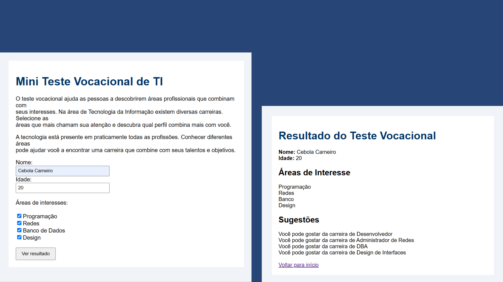

<h1 align="center"> Mini teste vocacional de TI </h1>

Atividade de sala de aula 

  <a href="#-tecnologies">Technologies</a>&nbsp;&nbsp;&nbsp;|&nbsp;&nbsp;&nbsp;
  <a href="#-projeto">Projeto</a>

 

  

## Technologies

Desenvolvido com:

- HTML 
- CSS
- PHP
- Canva
- Ferramenta de captura do windows

## Projeto

Atividade.

- <a href="https://gustavowolfer.github.io/Mini-teste-vocacional-de-TI/" target="_blank" >Acesse o projeto, online</a>

---
